# Malware Traffic Analysis: Internal Metasploit Compromise & Data Exfiltration

## Executive Summary
This report details the analysis of a network packet capture (PCAP) involving an internal network compromise. The investigation revealed that a threat actor, already positioned within the internal network (`192.168.1.13`), successfully delivered a malicious Java payload (`DughwlK.jar`) to a victim machine (`192.168.1.12`). Upon execution, the payload established a reverse shell and the attacker successfully exfiltrated sensitive system and user files. No lateral movement was detected beyond the initial victim.

---

## Environment & Entity Overview
* **Analyst:** Dipesh KC
* **Victim Machine:** `192.168.1.12`
* **Attacker Machine:** `192.168.1.13` (Internal)
* **Benign Internal Server:** `192.168.1.9` 

---

## Indicators of Compromise (IoCs)

| Type | Indicator | Description |
| :--- | :--- | :--- |
| **Malicious File** | `DughwlK.jar` | Metasploit Java payload dropped on the victim machine. |
| **Hash (SHA-256)** | `7ab7db7c2edeae1a8f0fd2b43fd1b21c32d7b27b0e185a96947a294587fe013a` | Detected by 35/62 vendors on VirusTotal as a Java Hacktool/Trojan. |
| **Attacker IP** | `192.168.1.13` | Internal IP hosting the payload and C2 listener. |
| **Network (Delivery)** | `HTTP` via Port `8080` | Port used to serve the malicious `.jar` file. |
| **Network (C2)** | `TCP` Port `4444` | Common Metasploit port used for the reverse shell connection. |
| **Network (Exfil)**| `TCP` Port `12345` | Port used by the attacker to exfiltrate sensitive files. |

---

## Technical Investigation & Analysis

### 1. Initial Triage & Noise Reduction
The PCAP initially contained 12,672 packets. To establish a baseline and narrow the scope, I reviewed the endpoint conversations and protocol hierarchy. 

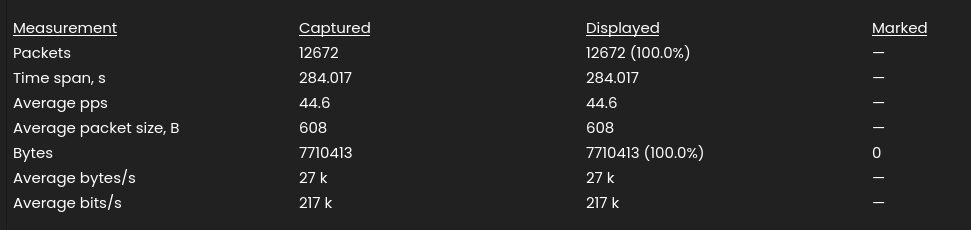

The protocol hierarchy revealed significant traffic across SMB, HTTP, and ARP. 
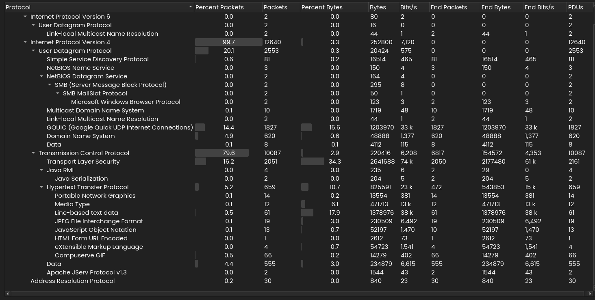

An initial check of ARP traffic ruled out an active ARP sweep/scan. 
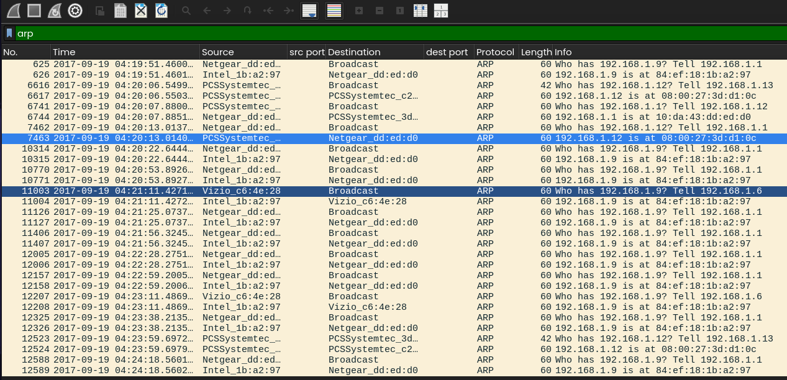

Focusing on HTTP GET and POST requests, I observed a high volume of legitimate traffic routing to an internal server at `192.168.1.9`. To isolate anomalous activity, I filtered out HTTP traffic involving this benign server (`http and not ip.addr == 192.168.1.9`).

### 2. Payload Delivery (`DughwlK.jar`)
Excluding the benign server exposed suspicious internal communications. The victim (`192.168.1.12`) made an HTTP GET request to `192.168.1.13` over port `8080` to download a file named `DughwlK.jar`. 

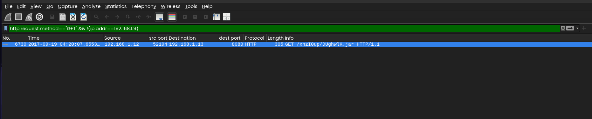

Following the HTTP stream confirmed the malicious nature of the download. The `User-Agent` was identified as `gnu-classpath` (a core Java library). Inspecting the payload strings within the stream revealed the keywords **"metasploit"** and **"payload"**, strongly indicating this was a generated Metasploit framework attack.

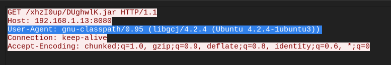
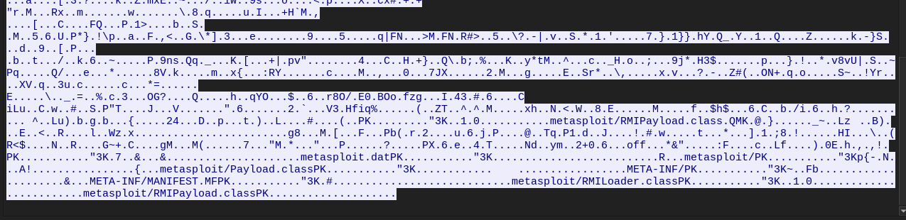

### 3. Malware Analysis & Verification
I extracted the `.jar` file from the PCAP for further analysis. Running the `strings` command locally verified the presence of the "metasploit" terminology.

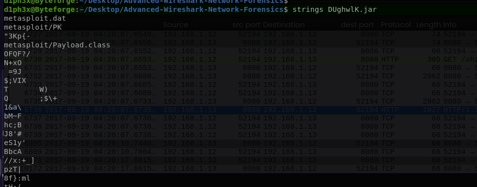

A cryptographic hash (SHA-256) of the extracted file was generated and queried against VirusTotal. The results confirmed the file is highly malicious, flagged by 35 out of 62 security vendors as a Java hacktool or trojan.

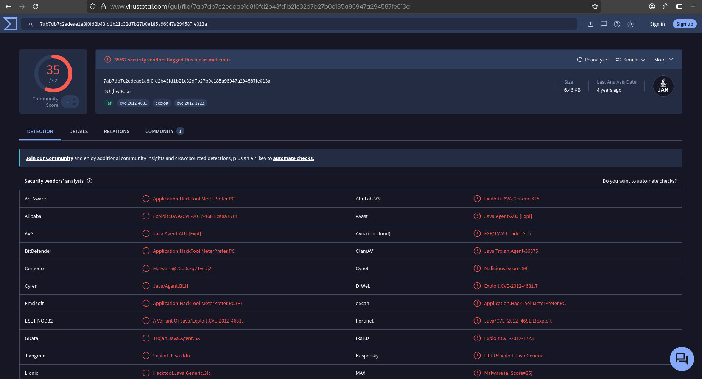

### 4. Command & Control (Reverse Shell)
Knowing the payload was a Metasploit artifact, I investigated whether it successfully executed by looking for a reverse shell connection. Filtering for TCP connections between the victim and attacker revealed established traffic over port `4444`, a default port for Metasploit listeners.

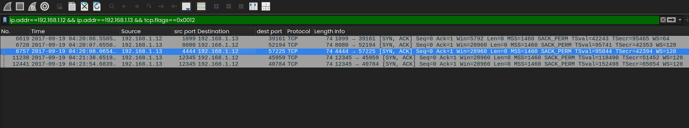

Following this TCP stream exposed the attacker's interactive command-line session. The attacker successfully gained **root access** to the victim machine. During this session, the attacker issued commands to read sensitive files and initiated a transfer of these files to a newly opened port (`12345`) on their machine.

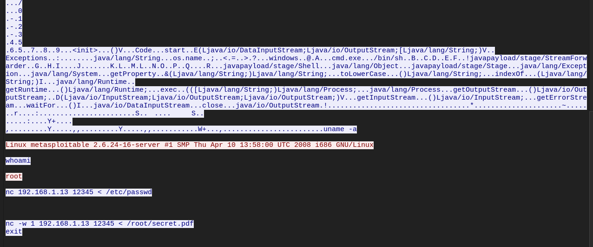

### 5. Data Exfiltration
I filtered the network traffic for communication directed to destination port `12345`. The captured packets confirmed that the attacker successfully exfiltrated two specific files over this channel:
1.  `/etc/passwd` (System user information)
2.  `/root/secret.pdf` (Sensitive document)

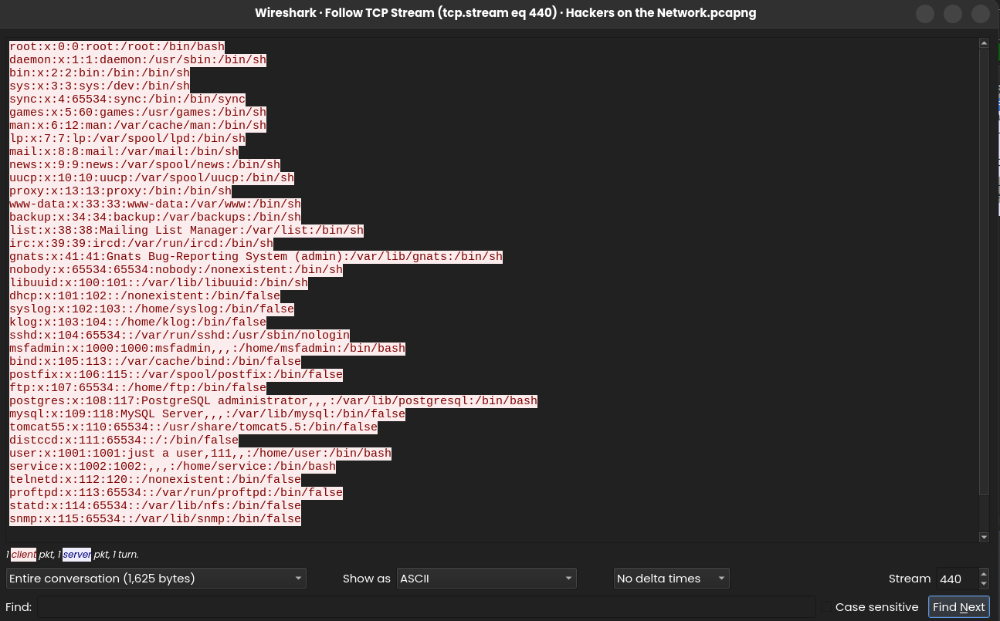
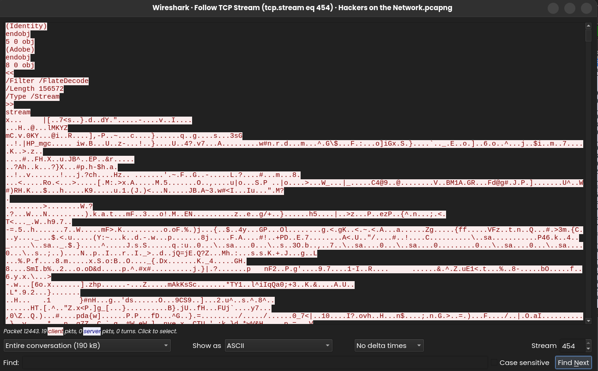

By extracting the packet data containing the PDF and converting it from ASCII to raw bytes, I successfully reconstructed the exfiltrated document. Opening the file revealed a "congratulations" message, confirming the integrity of the captured exfiltration stream.

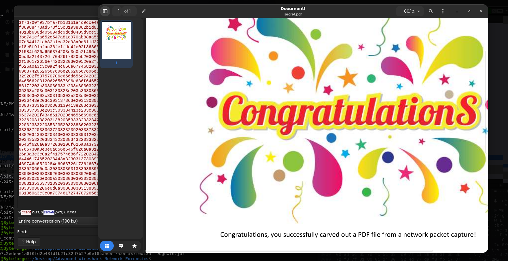

### 6. Lateral Movement Investigation
A brief investigation into the captured SMB traffic showed mentions of "metasploitable" but yielded no further actionable intelligence. 

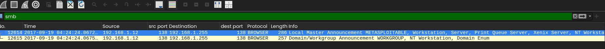

To determine the scope of the breach, I analyzed the network communication paths of both the attacker and the victim. `192.168.1.13` only communicated with the victim, and the victim's external communications were limited to the gateway (`192.168.1.1`) and local broadcast (`192.168.1.255`). There was no evidence of lateral movement to other internal endpoints.

---

## Conclusion
The threat actor was already situated within the internal network (`192.168.1.13`) prior to this specific attack chain. From this internal vantage point, they hosted a malicious Java payload, lured or forced the victim (`192.168.1.12`) to download and execute it, established a root-level reverse shell, and successfully exfiltrated sensitive data.
