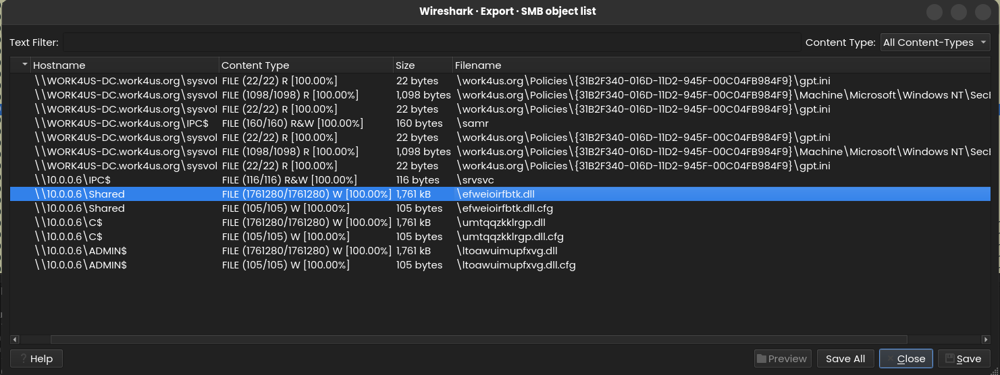
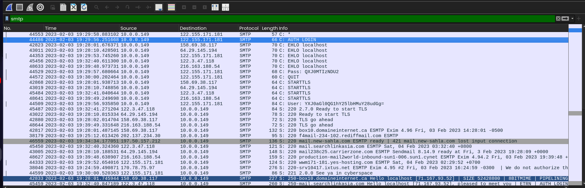
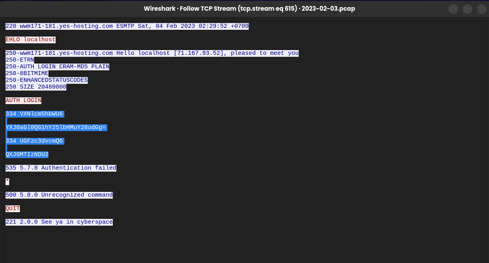

# Network Analysis: Using Wireshark to Investigate QakBot Malware

## Executive Summary
I analyzed a packet capture (PCAP) file containing **55,207 packets** to find out what caused some strange activity on the network. During my investigation, I uncovered a complete cyber attack carried out by the **QakBot (Qbot/QuakBot)** banking trojan. 

I found that the attack started on **2023-02-03** when an internal server (`10.0.0.149`) downloaded a malicious payload disguised as a `.dat` file over HTTP. Once the attacker compromised this server, they used it to scan our internal network using ARP and ICMP (ping) sweeps to discover other live machines. I confirmed that the attacker successfully moved laterally to an internal workstation (`10.0.0.6`) over SMB and dropped the exact same malware there. Finally, I caught the attacker attempting to send stolen network credentials over unencrypted SMTP traffic, which allowed me to extract and decode the passwords into plain text.

This report acts as my technical walkthrough of the investigation. It includes my step-by-step process, a MITRE ATT&CK mapping table, a timeline of events, and a list of Indicators of Compromise (IoCs).

---

## Incident Overview & Metadata
* **Analyst:** Dipesh KC
* **Date of Analysis:** June 13, 2026
* **Incident Date:** February 3, 2023
* **Artifact Analyzed:** Network Packet Capture (PCAP)
* **Total Volume:** 55,207 Packets
* **Severity Rating:** **CRITICAL** (Active Lateral Movement & Exposed Credentials)
* **Primary Threat Vector:** Malicious HTTP File Download
* **Target Malware:** QakBot (Qbot)

---

## MITRE ATT&CK Framework Mapping

| Tactic | Technique ID | Technique Name | What I Observed the Attacker Doing |
| :--- | :--- | :--- | :--- |
| **Initial Access / C2** | T1105 | Ingress Tool Transfer | I saw the server (`10.0.0.149`) download the `86607.dat` payload from an external IP (`128.254.207.55`) over HTTP. |
| **Discovery** | T1016 | System Network Configuration Discovery | I detected an automated ARP scan across the subnet to map out active hosts. |
| **Discovery** | T1046 | Network Service Discovery | I tracked ICMP ping sweeps and multi-port TCP connection attempts (Port Scanning) targeting `10.0.0.1`. |
| **Lateral Movement** | T1021.002 | Remote Services: SMB/Windows Admin Shares | I observed the attacker transferring a malicious DLL and a configuration file (`dll.cfg`) to a target workstation (`10.0.0.6`). |
| **Credential Access** | T1110 / T1040 | Brute Force / Network Sniffing | I caught an unencrypted SMTP `AUTH LOGIN` sequence containing Base64-encoded credentials being sent to `122.155.171.181`. |

---

## Analysis & Investigation Process

### 1. Initial Assessment & Environment Triage
I started my investigation by checking the general properties of the captured PCAP file to see what I was working with.

The file properties showed a total packet count of **55,207**. Since it is impossible to manually look through every single packet, I knew I had to narrow down the list. I decided to open the IPv4 conversation statistics to see which machines were talking the most.

From the above stats, I confirmed that the IP **`10.0.0.149`** must be some kind of server or victim as almost all the other machines share connections with it. Also, the IP **`10.0.0.6`** is an interesting IP to look into as the server seems to have the most number of packet exchanges with this IP.

### 2. Checking the Protocol Hierarchy & Initial Access
After this, I checked the protocol hierarchy to see what types of traffic were running through our network.

I found some interesting protocols to look into: **SMTP, SMB, and HTTP**. I decided to look into HTTP first because the PCAP only contains 4 packets of it, making it easy to inspect.

The server (`10.0.0.149`) requested an `86607.dat` file, which is already suspicious enough. On top of that, `128.254.207.55` is the external IP that the `.dat` file is being downloaded from.

### 3. Extracting Malware & Checking Threat Intelligence
I extracted the file directly from the HTTP stream.

Then, I checked the sha256sum of the file and went to investigate further in virustotal.com:

The query showed that **54 out of 69 vendors** stated that the file is harmful, and all of them state it is some kind of trojan (**QakBot / Qbot / QuakBot**). 

So, I researched a bit about QakBot. According to an article posted by sophos.com, once a QakBot infects a system, it performs an ARP scan to look for other machines for the sole purpose of lateral movement.

I wanted to confirm this behavior, so I used a display filter in Wireshark to verify it.

### 4. Spotting Reconnaissance & Internal Discovery
The packets confirmed it. So, I thought that if the attacker had found any other machine on the network, they might have run a ping to confirm it. I filtered out ICMP packets to confirm the ping requests.

We can see that the attacker found two IPs: `10.0.0.6` and `10.0.0.1`. 

When I filtered for `10.0.0.1` in Wireshark, I found a lot of failed TCP handshakes on different ports, indicating the attacker might have tried port scanning.

### 5. Tracking Lateral Movement
When I checked the protocol hierarchy earlier, I saw some SMB packets. So, I decided to look into that:

We can see some randomly named `.dll` and `dll.cfg` files, which is suspicious enough to make us investigate. I exported all the `.dll` and `dll.cfg` files, then I checked their sha256sum:

When I was about to search for the sha256sum on VirusTotal, I realized that it is the exact same sha256sum as the `.dat` file we found at the start of our investigation. Because of this, I can tell that the attacker was successful in lateral movement to a different machine (`10.0.0.6`) in the network.

### 6. Investigating Credential Theft
I also saw some SMTP packets in the protocol hierarchy, so I decided to check them out too:

I saw "AUTH LOGIN" in a packet at the start of the info section. I looked into the conversation by selecting **Follow > TCP Stream**.

We can see some Base64 encoded data under "AUTH LOGIN". Even though it was an authentication failure, I decided to decode it using CyberChef:

Now we can see the cleartext credentials. 

In summary, I can say that it was a successful attack by an attacker. The attacker used a QakBot trojan to gain access to the server (`10.0.0.149`) and then moved laterally to `10.0.0.6`.

---

## My Wireshark Display Filter Cheat Sheet
These are the primary filters I built and applied to isolate the malicious behaviors during this case:
* **To find the initial payload download:** `http.request.method == "GET" && http.request.uri contains ".dat"`
* **To isolate the network discovery sweeps:** `arp`
* **To watch the ping sweeps:** `icmp.type == 8 || icmp.type == 0`
* **To pinpoint active port scanning flags:** `tcp.flags.syn == 1 && tcp.flags.ack == 0`
* **To monitor files transferred over network shares:** `smb2.filename`
* **To catch cleartext email authentication attempts:** `smtp contains "AUTH"`

---

## Timeline Reconstruction

| Timestamp (UTC) | Source Host | Destination Host | Event Type | What I Observed |
| :--- | :--- | :--- | :--- | :--- |
| **2023-02-03 17:04:25** | `10.0.0.149` | `128.254.207.55` | **Initial Access** | I saw the server (`10.0.0.149`) download the malicious `86607.dat` file over HTTP, which kicked off the QakBot infection. |
| **2023-02-03 19:22:30** | `10.0.0.149` | Subnet Broadcast | **Discovery** | I traced an aggressive ARP scan coming from the infected server to map out local network devices. |
| **2023-02-03 19:29:56** | `10.0.0.149` | `122.155.171.181` | **Credential Theft** | I observed the server attempting an outbound SMTP connection while passing stolen credentials encoded in Base64. |
| **2023-02-03 19:47:12** | `10.0.0.149` | `10.0.0.6` | **Discovery** | I found ICMP pings sent by the attacker to verify that host `10.0.0.6` was up and responding. |
| **2023-02-03 19:47:40** | `10.0.0.149` | `10.0.0.6` | **Lateral Movement** | I confirmed that the attacker successfully sent the malicious QakBot DLL and its config file (`dll.cfg`) to `10.0.0.6` over SMB. |
| **2023-02-03 19:49:17** | `10.0.0.149` | `10.0.0.1` | **Discovery** | I monitored the attacker sending ICMP pings to target the network gateway at `10.0.0.1`. |
| **2023-02-03 19:49:17** | `10.0.0.149` | `10.0.0.1` | **Discovery** | I discovered an active, multi-port TCP port scan hitting `10.0.0.1` right after the ping. |

---

## Indicators of Compromise (IoCs)

### 1. Network Identifiers (IP Addresses)
* **`10.0.0.149`** - Infected Server (Patient Zero - Internal)
* **`10.0.0.6`** - Compromised Workstation (Lateral Movement Target - Internal)

### 2. Host-Based Identifiers (File Names & Hashes)
* **File Name:** `86607.dat`
  * **Type:** QakBot Trojan Executable Payload
  * **SHA256 Hash:** `713207d9d9875ec88d2f3a53377bf8c2d620147a4199eb183c13a7e957056432`
* **File Name:** `%5cefweioirfbtk.dll, %5cltoawuimupfxvg.dll and %5cumtqqzkklrgp.dll` (Sent to `10.0.0.6` over SMB)
  * **Type:** Dynamic Link Library (DLL)
  * **SHA256 Hash:** `713207d9d9875ec88d2f3a53377bf8c2d620147a4199eb183c13a7e957056432 - Cryptographically identical to 86607.dat`
* **File Name:** `%5cefweioirfbtk.dll.cfg, %5cltoawuimupfxvg.dll.cfg and %5cumtqqzkklrgp.dll.cfg`
  * **Type:** Malware Configuration File

---

## My Remediation & Hardening Recommendations

### Immediate Containment Actions
1. **Isolate the Victims:** I recommend completely disconnecting `10.0.0.149` and `10.0.0.6` from the network segment right away to prevent further lateral movement or potential ransomware installation.
2. **Reset Compromised Credentials:** I recommend forcing an immediate domain-wide password reset for any user credentials exposed in the plain text SMTP stream.
3. **Block Rogue IPs:** I recommend updating perimeter firewalls to block all incoming and outgoing connections to external IPs `128.254.207.55` and `122.155.171.181`.

### Long-Term Network Hardening
1. **Deploy EDR Software:** Enforce Endpoint Detection and Response (EDR) tools across all internal workstations and servers to catch malicious memory injections, unauthorized local scans, and rogue DLL executions early.
2. **Restrict SMB Traffic:** Block workstation-to-workstation SMB communications (Port 445) using local firewalls or network segmentation so attackers cannot move laterally between devices easily.
3. **Phase Out Plain Text Protocols:** Stop the use of unencrypted HTTP for executable downloads at the proxy layer, and upgrade legacy unencrypted SMTP (Port 25) to secure options like SMTPS (Ports 465 or 587) to block credential sniffing.
