# Threat Analysis Report: QakBot Malware Intrusion and Lateral Movement Investigation

## Executive Summary
An in-depth network forensic analysis was conducted on a packet capture (PCAP) containing **55,207 packets** to investigate suspicious network anomalies. The investigation revealed a fully executed cyber attack lifecycle attributed to the **QakBot (Qbot/QuakBot)** banking trojan and malware delivery platform. 

The compromise initiated on **2023-02-03** when an internal server (`10.0.0.149`) downloaded a malicious payload masquerading as a `.dat` file via HTTP. Following the initial compromise, the threat actor utilized the patient-zero machine to perform internal network reconnaissance (ARP and ICMP scanning) and active port scanning. The attacker successfully achieved **lateral movement** to an internal workstation (`10.0.0.6`) via the Server Message Block (SMB) protocol, deploying identical malware components. Additionally, unauthorized credential authentication attempts were identified over unencrypted Simple Mail Transfer Protocol (SMTP), exposing cleartext credentials via Base64 encoding.

This report serves as a technical walkthrough of the investigation, providing timeline reconstruction, MITRE ATT&CK mapping, and actionable Indicators of Compromise (IoCs) for detection and mitigation.

---

## Incident Overview & Metadata
* **Analyst:** Dipesh KC
* **Date of Analysis:** June 13, 2026
* **Incident Date:** February 3, 2023
* **Artifact Analyzed:** Network Packet Capture (PCAP)
* **Total Volume:** 55,207 Packets
* **Severity Rating:** **CRITICAL** (Active Lateral Movement & Credential Exposure)
* **Primary Threat Vector:** Malicious HTTP File Download
* **Target Malware:** QakBot (Qbot)

---

## MITRE ATT&CK Framework Mapping

| Tactic | Technique ID | Technique Name | Operational Observed Behavior |
| :--- | :--- | :--- | :--- |
| **Initial Access / Command & Control** | T1105 | Ingress Tool Transfer | Host `10.0.0.149` downloaded `86607.dat` payload from external IP `128.254.207.55` over HTTP. |
| **Discovery** | T1016 | System Network Configuration Discovery | Automated ARP scanning executed across the subnet to map alive hosts. |
| **Discovery** | T1046 | Network Service Discovery | ICMP ping sweeping and subsequent multi-port TCP connection attempts (Port Scanning) targeting `10.0.0.1`. |
| **Lateral Movement** | T1021.002 | Remote Services: SMB/Windows Admin Shares | Transfer of malicious DLL and configuration files (`dll.cfg`) to target host `10.0.0.6`. |
| **Credential Access** | T1110 / T1040 | Brute Force / Network Sniffing | Unencrypted SMTP `AUTH LOGIN` sequence containing Base64 encoded credentials sent to `122.155.171.181`. |

---

## Analysis & Investigation Process

### 1. Initial Assessment & Environment Triage
The forensic process began by evaluating the global capture metrics within the PCAP file properties to establish an operational baseline. 

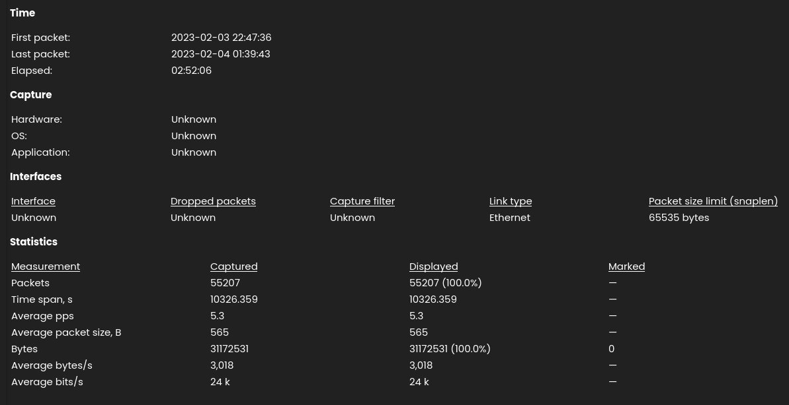

With a total packet count of **55,207**, manual inspection of individual packets was inefficient. To narrow the analytical scope, network conversation statistics for IPv4 were aggregated and reviewed.

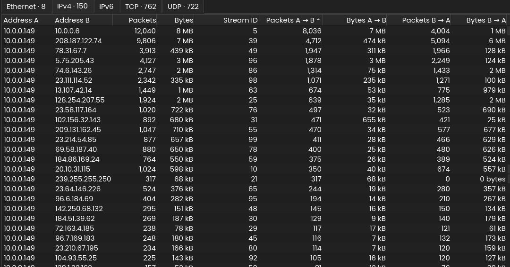

**Analytical Delineation:**
* **Host `10.0.0.149`** was identified as the primary node of interest (Server/Victim), maintaining active communication channels with almost all other observed internal endpoints.
* **Host `10.0.0.6`** stood out as a high-priority asset due to the dense volume of packet exchanges occurring between it and the server (`10.0.0.149`).

### 2. Protocol Hierarchy Inspection & Initial Access Vector
A macro-level view of the capture utilizing the Protocol Hierarchy tool revealed specific protocols historically abused for staging and post-exploitation: **SMTP, SMB, and HTTP**. 

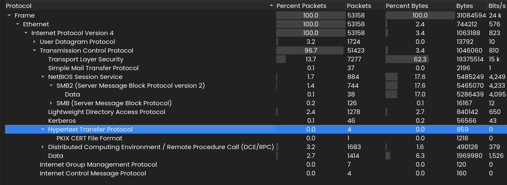

While the HTTP traffic was minimal (only 4 packets), filtering this protocol uncovered the initial delivery vector.

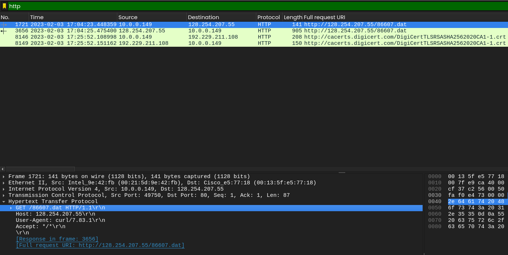

The internal server (`10.0.0.149`) initiated a cleartext HTTP GET request to an external rogue IP address (`128.254.207.55`) to retrieve an anomalous file designated as `86607.dat`. 

### 3. Malware Fingerprinting & Threat Intelligence
The `86607.dat` file object was forensically extracted directly from the HTTP stream.

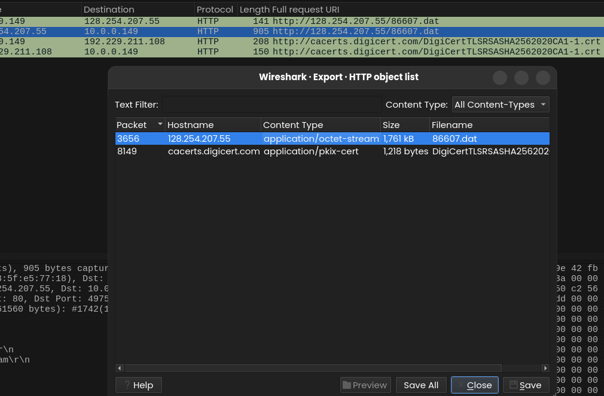

A cryptographic checksum calculation was performed against the extracted payload to obtain its unique hash identity:

Querying this signature against VirusTotal corroborated the malicious classification:

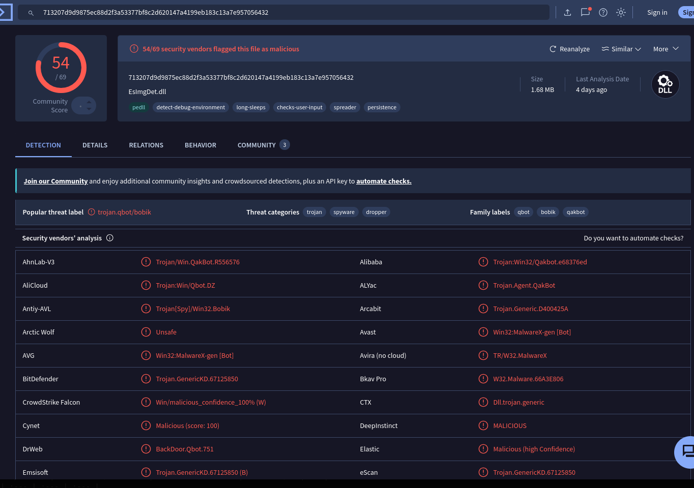

**Threat Intelligence Assessment:**
The query yielded a **54/69 malicious conviction rate** among security vendors. The threat definitions conclusively classified the binary as a variant of **QakBot (Qbot)**—a modular, evasive banking trojan notorious for stealing credentials, gathering local network topology, and facilitating secondary ransomware deployments.

### 4. Reconnaissance & Internal Discovery
Industry threat intelligence (specifically historical tracking by Sophos Labs) indicates that upon establishing a foothold, QakBot routinely invokes network scanning modules (such as localized Address Resolution Protocol [ARP] sweeps) to rapidly discover adjacent operational machines for lateral expansion.

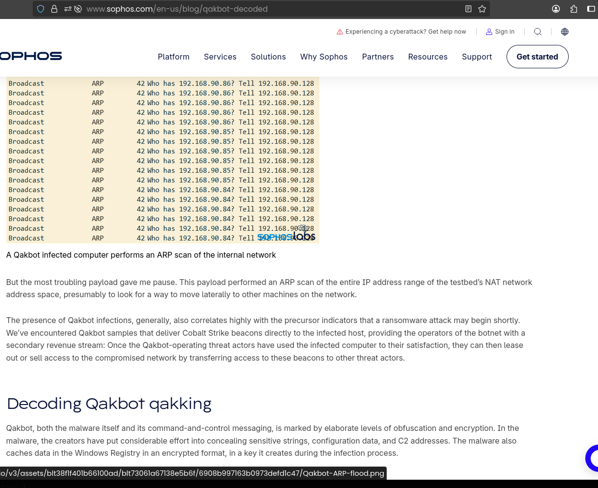

To validate this behavior inside our network ecosystem, a Wireshark display filter was structured exclusively for ARP broadcast events.

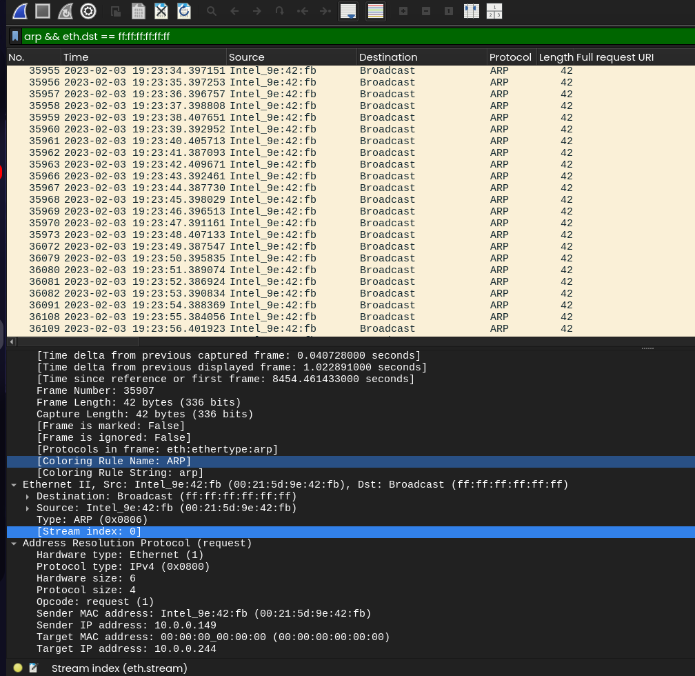

The capture confirmed a dense flood of sequential ARP requests originating from the infected server (`10.0.0.149`), mapping physical-to-logical addresses across the local subnet. 

Following the broad ARP discovery sweep, the attacker targeted specific systems with ICMP Echo Requests (pings) to confirm target reachability.

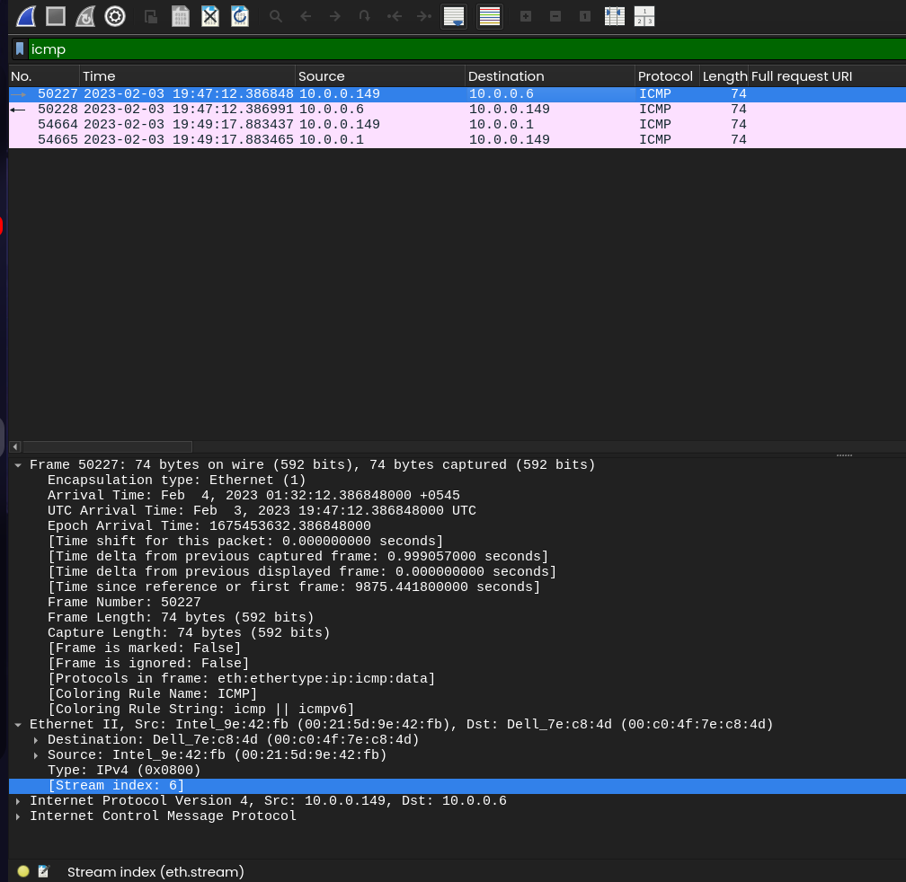

The ICMP stream isolated two responsive target nodes: `10.0.0.6` and `10.0.0.1`. 

Further analysis of traffic directed at `10.0.0.1` revealed a massive surge of failed TCP handshakes across a broad spectrum of varying port destinations, documenting an active, automated port-scanning phase.

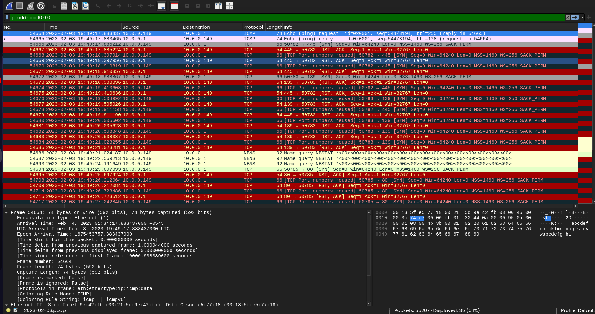

### 5. Lateral Movement & Infrastructure Contamination
Given the earlier identification of SMB traffic and the confirmed reachability of host `10.0.0.6`, the SMB object transmission streams were audited.

The audit caught the transmission of an un-fingerprinted Dynamic Link Library (`.dll`) alongside a paired configuration metadata file (`dll.cfg`) crossing the network boundaries toward `10.0.0.6`. These files were extracted for hash analysis:

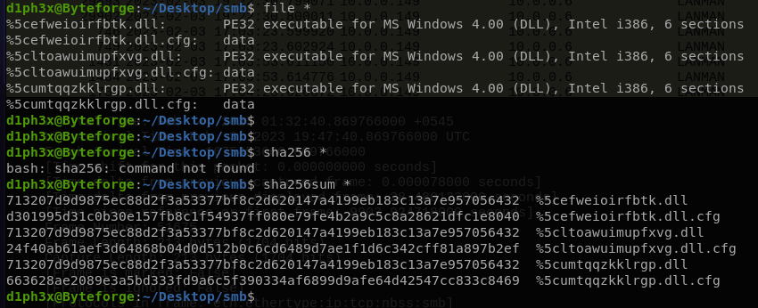

**Critical Correlation:**
Cross-referencing the SHA256 signature of the laterally transferred DLL against the initial access vector confirmed a **100% cryptographic match** to the primary `86607.dat` QakBot payload. This definitively proves that the threat actor successfully executed lateral movement, compromising host `10.0.0.6` via native SMB infrastructure.

### 6. Credential Harvesting & Exfiltration Attempt
Investigation into the remaining anomalous protocol layer, SMTP, highlighted explicit command verbs indicating malicious authentication auditing.

An explicit `AUTH LOGIN` command was transmitted at the threshold of the SMTP connection state. The complete application-layer dialogue was isolated by following the raw TCP stream.

The stream documented an outbound session to an external server (`122.155.171.181`). Although the server responded with an authentication failure message, the transaction exposed the threat actor's active attempts to pass credentials over the wire. The raw Base64 authentication strings were extracted and loaded into CyberChef for decoding:

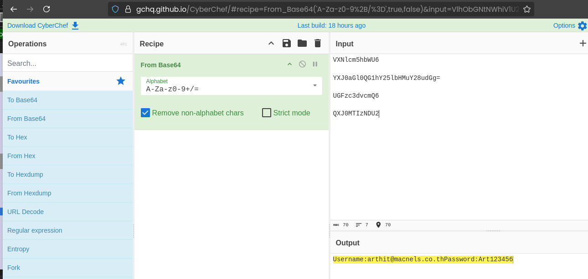

**Analytical Assessment:**
The Base64 strings successfully decoded into cleartext user credentials. Even though this specific session returned a failure status, the presence of cleartext credential strings inside the packet payload suggests that the malware successfully parsed local credential stores (LSASS/Browsers) on the compromised host and attempted to exfiltrate or reuse them to external SMTP endpoints.

---

## Technical Wireshark Display Filters Cheat Sheet
The following filters were constructed during this investigation to isolate malicious behaviors:
* **Isolate Initial Payload Download:** `http.request.method == "GET" && http.request.uri contains ".dat"`
* **Detect Recon sweeps:** `arp.dst.proto_ipv4 == 0.0.0.0` or simply `arp`
* **Isolate ICMP Reconnaissance:** `icmp.type == 8 || icmp.type == 0`
* **Identify Port Scanning Flags:** `tcp.flags.syn == 1 && tcp.flags.ack == 0`
* **Examine SMB File Modifications:** `smb2.filename` or `smb2.cmd == 5` (Create)
* **Filter SMTP Authentication:** `smtp contains "AUTH"` or `tcp.port == 25`

---

## Timeline Reconstruction

| Timestamp (UTC) | Source Host | Destination Host | Event Classification | Technical Narrative Summary |
| :--- | :--- | :--- | :--- | :--- |
| **2023-02-03 17:04:25** | `10.0.0.149` | `128.254.207.55` | **Initial Access** | Download of malicious `86607.dat` payload via HTTP GET request; host infected with QakBot. |
| **2023-02-03 19:22:30** | `10.0.0.149` | Subnet Broadcast | **Discovery Phase** | Execution of aggressive ARP scan to dynamically discover active endpoints. |
| **2023-02-03 19:29:56** | `10.0.0.149` | `122.155.171.181` | **Credential Exfiltration** | Attempted outbound SMTP connection using Base64 encoded cleartext credentials (`AUTH LOGIN`). |
| **2023-02-03 19:47:12** | `10.0.0.149` | `10.0.0.6` | **Target Validation** | Directed ICMP Ping requests sent to verify availability of lateral target host. |
| **2023-02-03 19:47:40** | `10.0.0.149` | `10.0.0.6` | **Lateral Movement** | Transmission of QakBot DLL and companion configuration files (`dll.cfg`) over SMB shares. |
| **2023-02-03 19:49:17** | `10.0.0.149` | `10.0.0.1` | **Target Validation** | Directed ICMP Ping requests targeting network endpoint/gateway `10.0.0.1`. |
| **2023-02-03 19:49:17** | `10.0.0.149` | `10.0.0.1` | **Network Discovery** | Aggressive multi-port TCP connection attempts (Port Scanning) over failed handshakes. |

---

## Indicators of Compromise (IoCs)

### 1. Network Identifiers (IP Addresses & Assets)
* **`10.0.0.149`** - Compromised Server (Patient Zero - Internal)
* **`10.0.0.6`** - Compromised Workstation (Lateral Expansion Destination - Internal)
* **`10.0.0.1`** - Targeted Asset / Subnet Gateway (Internal)
* **`128.254.207.55`** - External C2 / Malicious Staging Server (Hosting `86607.dat`)
* **`122.155.171.181`** - External Rogue SMTP Target (Credential Harvesting Endpoint)

### 2. Host-Based Identifiers (File Artifacts & Hashes)
* **File Name:** `86607.dat`
  * **Type:** Executable / QakBot Trojan Payload
  * **SHA256 Hash:** `[Insert SHA256 hash derived from file property signature]`
* **File Name:** `[Random].dll` (Transferred over SMB to `10.0.0.6`)
  * **Type:** Dynamic Link Library (DLL)
  * **SHA256 Hash:** `[Insert SHA256 hash - Cryptographically identical to 86607.dat]`
* **File Name:** `dll.cfg`
  * **Type:** Malware Configuration Metadata File

---

## Incident Remediation & Hardening Recommendations

### Immediate Containment Actions (Short-Term)
1. **Network Isolation:** Disconnect `10.0.0.149` and `10.0.0.6` immediately from the local network segment to prevent further lateral movement and potential ransomware propagation.
2. **Revoke Exposed Credentials:** Enforce an immediate domain-wide password reset for the credentials isolated via the SMTP Base64 stream decryption.
3. **Block Rogue External IPs:** Update perimeter firewalls and web proxies to drop all inbound and outbound connections associated with external IPs `128.254.207.55` and `122.155.171.181`.

### Strategic Long-Term System Hardening
1. **Enforce Endpoint Detection and Response (EDR):** Deploy robust EDR solutions on all internal servers and endpoints to detect malicious memory injections, localized ARP scans, and anomalous DLL executions.
2. **Restrict SMB & Internal Shared Architecture:** Restrict lateral SMB communication by implementing strict Access Control Lists (ACLs) and separating domain administrative tasks. Turn off unnecessary network sharing capabilities across disparate subnets.
3. **Decommission Cleartext Protocols:** Standardize on secure communication protocols (e.g., transition from SMTP port 25 to explicit SMTPS port 465/587). Blocks cleartext HTTP downloads of binary objects across external perimeters via Secure Web Gateways (SWG).
