# PCAP Analysis Report: FTP Brute-Force Attack

## 1. Executive Summary
This report details the investigation of a network capture (PCAP) file involving an FTP brute-force attack. The analysis identifies the attacker, the target, the methods used to gain unauthorized access, and the post-exploitation activities conducted over the network. The PCAP file appears to have been pre-filtered to isolate the relevant traffic.

## 2. Network Environment
Based on the conversation and protocol hierarchy analysis, only two main IP addresses are actively communicating in the filtered capture:
- **Attacker IP**: `192.168.56.101`
- **FTP Server IP (Target)**: `192.168.56.1`
- **Other Discovered Hosts**: `192.168.56.100`

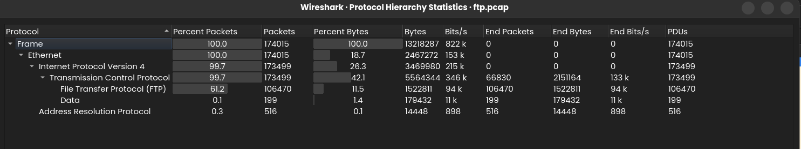
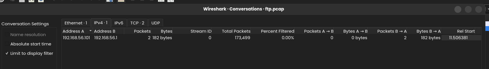

## 3. Pre-Attack Activity: ARP Scan
Before initiating the attack on the FTP server, the attacker performed an ARP scan to map the local network. This broadcast scan successfully identified another active host on the network (`192.168.56.100`).

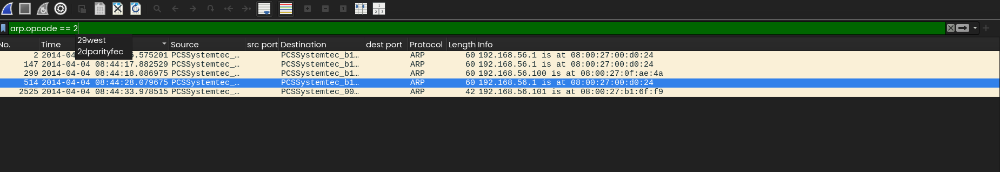

## 4. Attack Phase: FTP Brute-Force
Filtering the FTP packets revealed a high volume of login attempts originating from `192.168.56.101` directed at `192.168.56.1` within a very short timeframe. This rapid succession of authentication requests is a definitive indicator of a brute-force attack.

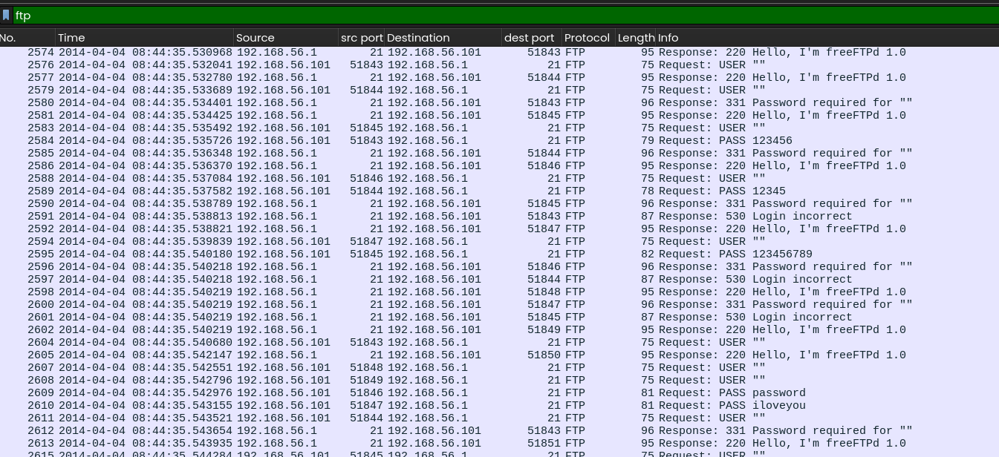

### Successful Authentication
According to the FTP protocol specifications, a `230` response code from the server indicates a successful user login. By filtering for this response code, the successful authentication attempt was isolated.
- **Timestamp**: `2014-04-04 08:45:57`
- **Compromised Credentials**:
  - **Username**: `anon`
  - **Password**: `anon`

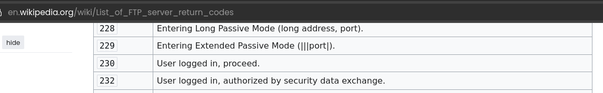
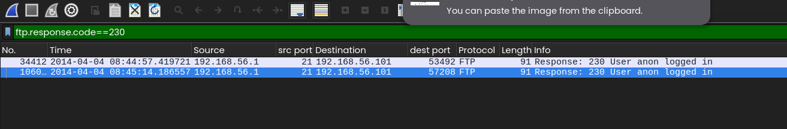
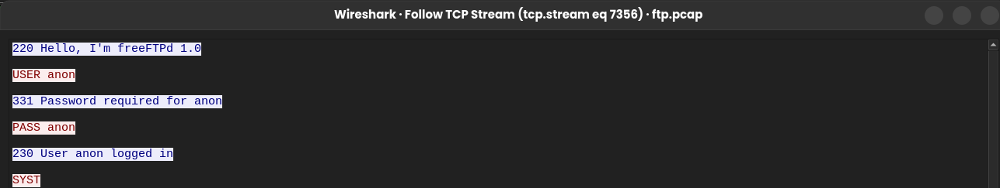

## 5. Post-Exploitation Activity
Following the successful login, the attacker's commands were analyzed by following the TCP stream. The attacker accessed the server and downloaded an image file.
- **Target File**: `Whywecanthavenicecat.png`
- **File Size**: 176,510 bytes

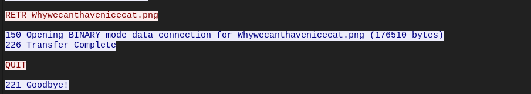

## 6. Artifact Extraction
To extract the downloaded image from the PCAP, the TCP conversations were reviewed to find a stream matching the approximate file size (~179 KB). 

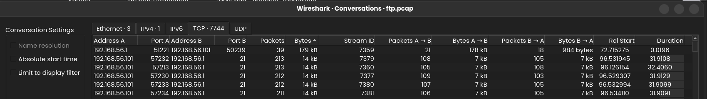
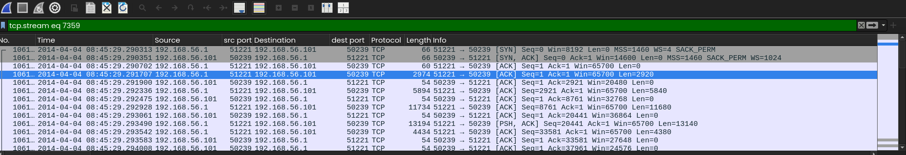

Following the identified stream ID, the ASCII view confirmed the presence of the `.PNG` magic bytes at the beginning of the file, indicating a valid PNG header. The payload was then exported in raw format to reconstruct the image.

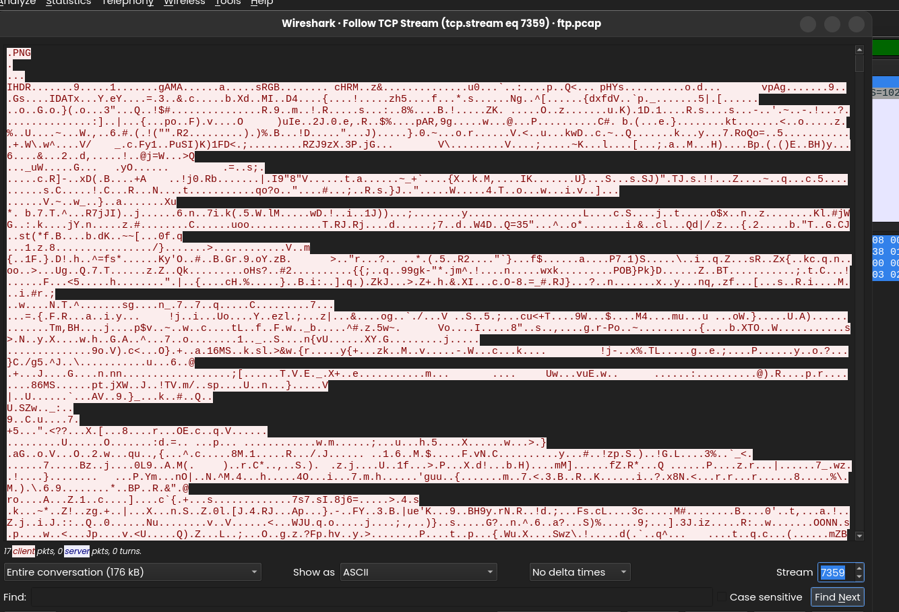
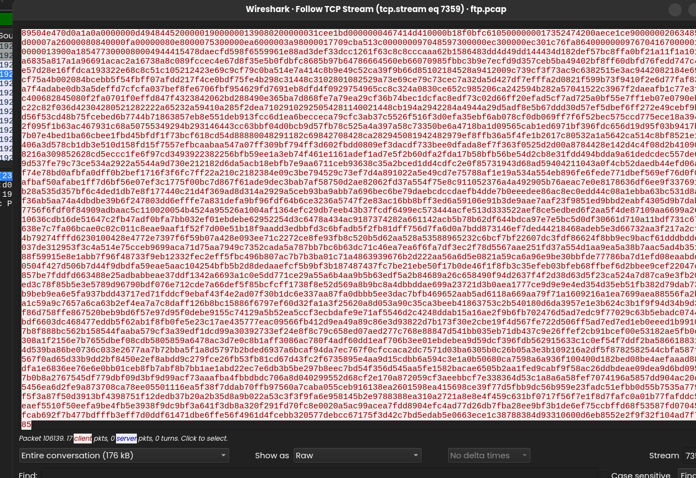

### Extracted File Details
- **Filename**: `Whywecanthavenicecat.png`
- **File Type**: PNG Image
- **SHA256 Hash**: `3071129047ab63eb505216a3fa036a8bc9d8144fb2828f7cac9520f7bb214416`

## 7. Conclusion
The investigation confirms that the host `192.168.56.101` successfully compromised the FTP server at `192.168.56.1` via a dictionary/brute-force attack. Prior to the exploit, the attacker mapped the network using an ARP scan. After obtaining access using the credentials `anon`:`anon`, the attacker successfully exfiltrated a PNG image file. Based on the provided network capture data, the investigation concludes here as no further activity is present in the trace.
